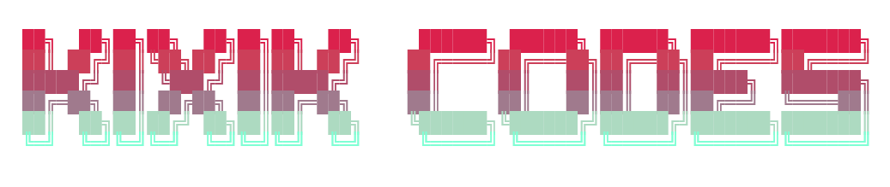

<h1 align="center">Welcome to the profile of</h1>

  

<h3 align="center">I'm a CompSci student at 42, (ex)concept / 3D artist and hobby electronic music production ethusiast.</h3>

### 🔧 &nbsp;My Toolbox

  <a href="https://skillicons.dev">
    
Tools/Frameworks:

    
    
Software:

    
    
Languages:

    
  </a>

### 📚 &nbsp;Notable 42 Core Projects
Some stuff I've done as a student I am proud of.
- [ft_transcendence (42)](https://github.com/kixikCodes/ft_transcendence)
- [Webserv (42)](https://github.com/kixikCodes/webserv)
- [miniRT (42)](https://github.com/kixikCodes/miniRT)
- [minishell (42)](https://github.com/kixikCodes/minishell)

### 🧪 &nbsp;Personal Projects
All still work in progress at the moment or coming up.
- Particle Sandbox (not public yet)
- [BotC Gamemaster](https://github.com/kixikCodes/BOTC_Gamemaster)
- Advent of Code 2025 in Python (upcoming!)
- The soundtrack to [Cimex's](https://github.com/Cimex404) upcoming game... 🤫

### 📊 &nbsp;Profile Stats

